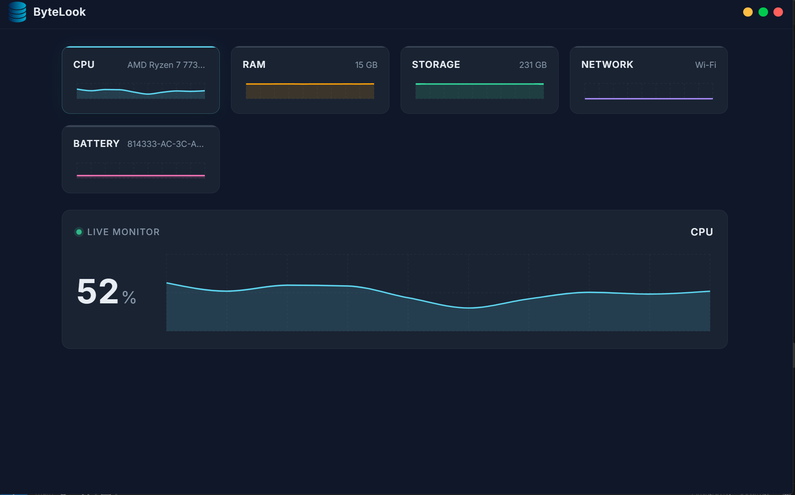

# ⚡ ByteLook Memory Manager

**🌐 Live Website & Download:** [https://bytelook.vercel.app/](https://bytelook.vercel.app/)

ByteLook is a lightweight, real-time system monitor for Windows. Built with modern web technologies, it allows you to track your computer's vital signs—CPU, RAM, Storage, Network, and Battery—in a beautiful, native-feeling desktop application.

 
*(Note: Add an actual screenshot to your assets folder and update this path if needed)*

## ✨ Features

- **Real-Time Monitoring:** Live charts tracking CPU, RAM, Storage, Network, and Battery, updated every 500ms.
- **Smart Alerts:** Native desktop notifications alert you when your CPU or RAM usage exceeds 90%.
- **System Tray Integration:** Runs quietly in your system tray without cluttering your taskbar.
- **Beautiful UI:** A stunning glassmorphic dark theme with smooth animations powered by Recharts.
- **Highly Secure:** Built following strict Electron security guidelines (Context Isolation, Sandboxing, and disabled Node integration in the renderer).
- **Type-Safe IPC:** Strongly typed Inter-Process Communication between the Node.js backend and the React frontend.

## 🛠️ Tech Stack

- **Frameworks:** Electron, React, Vite
- **Language:** TypeScript
- **Visualization:** Recharts
- **System APIs:** `systeminformation`, `os-utils`
- **Build Tool:** electron-builder

## 🚀 Getting Started

### Prerequisites
Make sure you have [Node.js](https://nodejs.org/) (v18 or higher) installed on your machine.

### Installation

1. Clone the repository:
   ```bash
   git clone https://github.com/Nandani1512/Memory-manager.git
   cd Memory-manager
   ```

2. Install dependencies:
   ```bash
   npm install
   ```

### Development

To run the application in development mode with Hot Module Replacement (HMR) for the frontend:

1. Start the Vite dev server (in one terminal):
   ```bash
   npm run dev
   ```

2. Start the Electron app (in a second terminal):
   ```bash
   npm run electron:start
   ```

### Building for Production

To compile the TypeScript and package the app into a standalone Windows installer (`.exe`):

```bash
npm run dist
```

The compiled installer will be available in the `release/` directory.

## 🤝 Contributing
Contributions, issues, and feature requests are welcome! Feel free to check the [issues page](https://github.com/Nandani1512/Memory-manager/issues).

## 📄 License
This project is open source and available under the MIT License.
